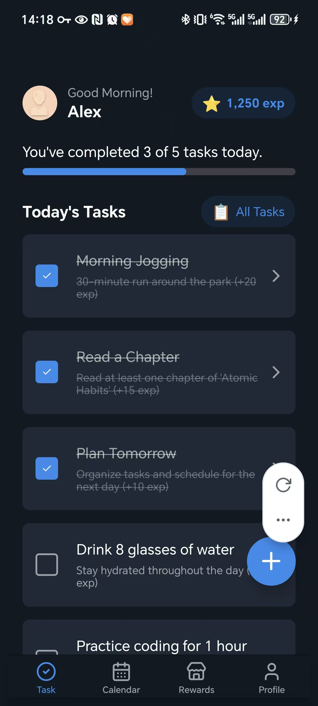
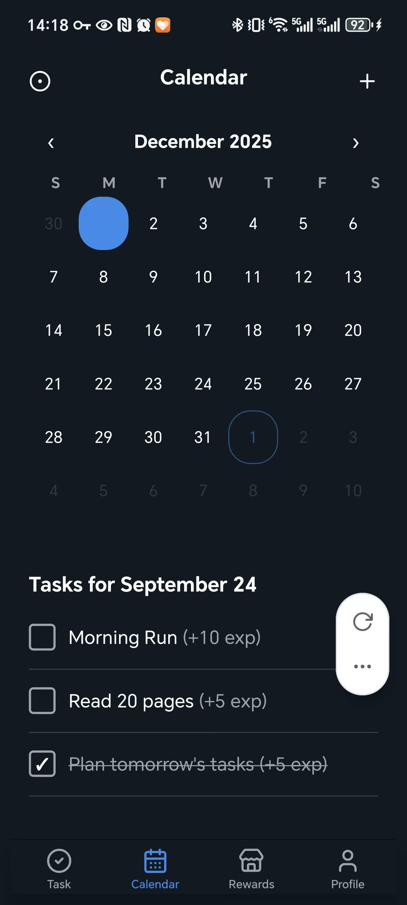

# exp - 任务导向自律养成工具

## 项目简介

exp 是一个以任务为导向、商城商品作为激励的自律养成工具。用户通过完成任务获得积分，用积分在商城兑换商品，形成正向激励循环，帮助养成良好习惯。

## preview

|  |  |  |  |
|:--:|:--:|:--:|:--:|

## 核心功能

### 任务管理
- **创建任务**：设置任务名称、描述、完成奖励积分
- **重复设置**：支持每日、每周、每月重复模式
  - 按日重复, 则可以设置每n天执行
  - 按周重复, 则可以设置每周几重复, 例如每周一, 周二
  - 按月重复, 可可以设置每月几号重复, 例如每月15号, 20号
- **结束条件**：按完成次数、截止日期或手动停止
- **子任务**：支持多选项任务，可选择手动或随机模式
  - 子任务仅仅是一个名称数组
  - 例如有一个"读书"任务有三个子任务"小王子","活着","1984"
- **任务模板**：基于模板动态生成任务实例

### 日历视图
- **日期筛选**：查看指定日期的待执行任务
- **任务预览**：日历界面显示任务完成状态

### 积分商城
- **商品管理**：创建、编辑、删除商城商品
- **自动补货**：支持多种补货周期设置
  - 按日补货, 则可以设置每n天执行
  - 按周补货, 则可以设置每周几重复, 例如每周一, 周二
  - 按月补货, 可可以设置每月几号重复, 例如每月15号, 20号
- **库存控制**：设置库存上限，避免过度补货

### 个人中心
- **积分管理**：查看当前积分余额
- **背包系统**：管理已购买商品，支持使用功能

## 技术特点

- **响应式设计**：适配多种设备屏幕
- **本地存储**：数据持久化，保护用户信息
- **直观界面**：简洁易用的操作体验
- **灵活配置**：丰富的任务和商品设置选项
- 技术栈: expo, sqlite, drizzle, zustand

## 使用场景

- 个人习惯养成
- 学习计划管理
- 工作任务跟踪
- 健康生活规划
